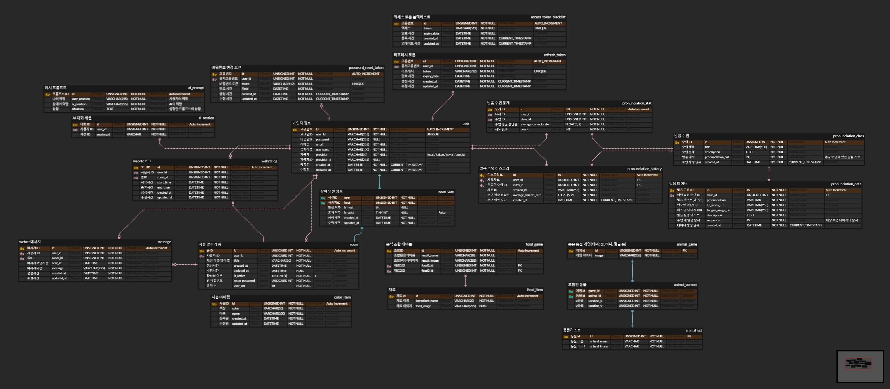
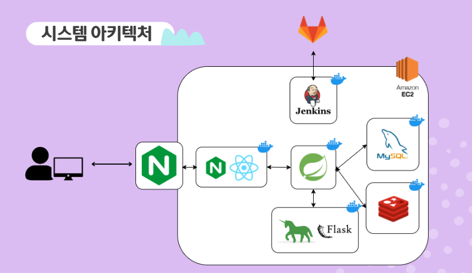
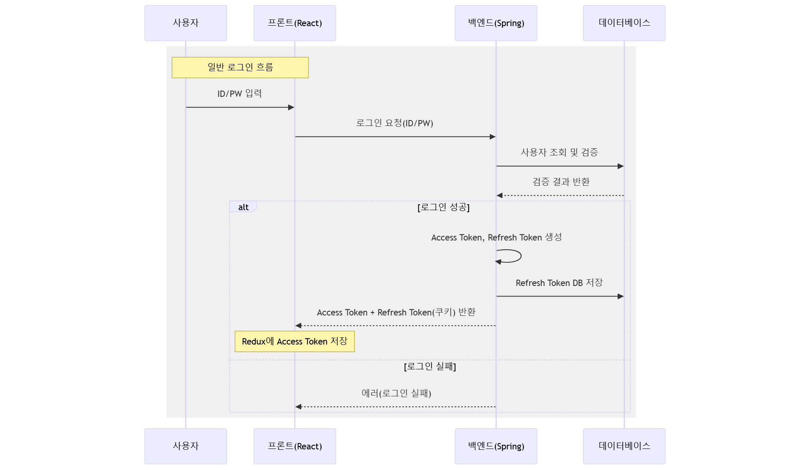
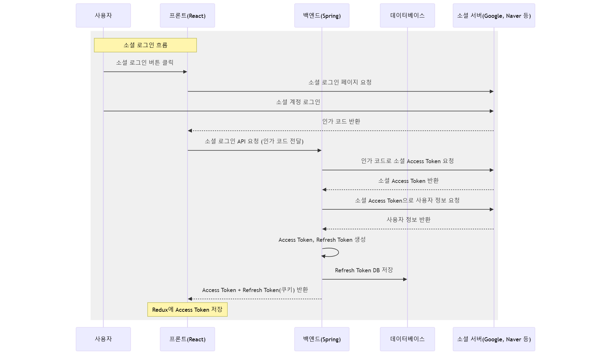
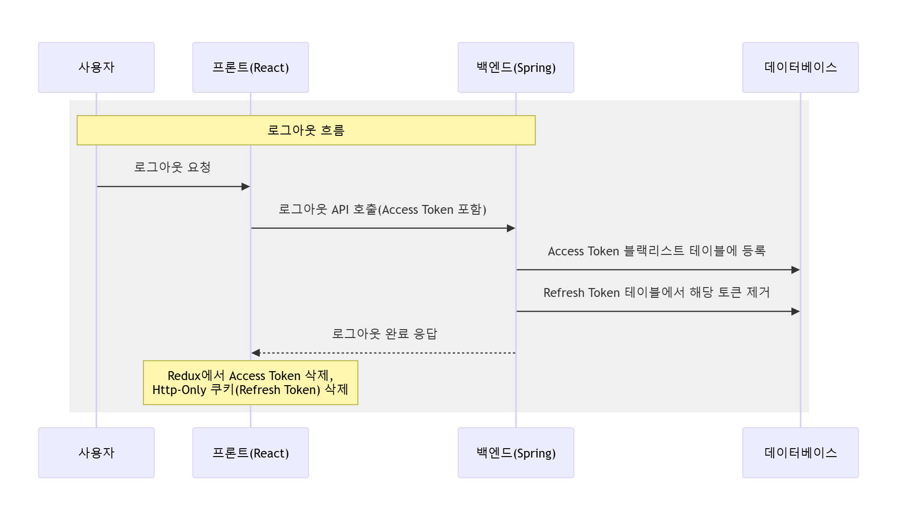

# 🎯 청각 장애인 아동을 위한 언어 지도 서비스 **마래바**

---
## ✅프로젝트 진행 기간
2025.01.13 ~ 2024.02.21(6주)

---

## 🚩 서비스 한줄 소개
음성 AI와 WebRTC 기반 청각 장애 아동 언어지도 서비스

---
## 📌 개요

마래바는 청각 장애인 아동이 효과적으로 발음을 교정하고 언어를 익힐 수 있도록 돕는 서비스입니다.
AI 기술과 WebRTC를 활용한 게임을 통해 청각 장애 아동이 재밌게 학습 할 수 있습니다.
발음 연습 및 피드백 기능을 제공하며, 단어 게임 AI 대화를 통해 언어 능력을 기를 수 있습니다.

---

## 🌱 프로젝트 설명 및 목표
- 마래바는 사용자의 접근성을 향상하고, 즉각적인 피드백을 제공할 수 있으며, 동기를 부여할 수 있는 언어지도 서비스를 만듭니다.
- 발음 연습을 통해 발음의 정확도를 파악할 수 있습니다.
- 발음 학습 후 마이페이지를 통해 학습율을 파악할 수 있습니다.
- 단어 게임의 경우, 사용자 친화적인 UI로 꾸며진 요리 게임과 동물 찾기를 통해, 발음으로 알맞은 단어를 선택할 수 있습니다.
- 실시간 화상 채팅 게임은 WebRTC기술을 사용하여, 상대방의 입모양을 읽는 독순술을 학습하고, 동시에 단어를 추리하여 말할 수 있게끔 합니다.

- 위의 기술들을 사용할 경우, 언어 발달, 자신감 향상, 인재 양성의 기대효과를 바랄 수 있습니다.

---

## 🛠️ 기술 스택

### **Front-End**

- Vite, React, Nginx

### **Back-End**

- Spring Boot, Flask, Gunicorn, JPA

### **Database & Cache**

- MySQL, Redis

### **Infrastructure & DevOps**

- Docker, Jenkins, AWS EC2, Nginx

---

## 🚀 주요 기능

1. **발음 연습 및 피드백**

   - 원하는 발음 수업을 골라서 연습 할 수 있습니다.
   - 영상과 시각 자료를 보고 발음을 따라하며 녹음합니다.
   - Sherpa-ONNX Zipformer 기반의 한글 STT 모델을 사용하여 음성을 한글로 변환합니다.
   - 제시된 발음과 다르다면 ChatGPT API를 사용하여 발음 피드백을 제공합니다.
   - 학습이 끝나면 히스토리로 정답률이 저장되고, 부모 페이지에서 아이의 발음별 통계를 볼 수 있습니다.

2. **단어 게임**

   - 단어 게임은 음식 게임과 동물 게임이 있습니다.
   - 음식 게임
   - 제시된 음식을 보고 보기에서 재료를 유추하는 게임입니다.
   - 음성을 녹음하여 재료를 선택합니다.
   - 동물 게임
   - 제시된 그림을 보고 숨어있는 동물을 유추하는 게임입니다.
   - 음성을 녹음하여 동물을 맞춰봅니다.

3. **AI와 대화하기**

   - ChatGPT를 사용하여 대화 할 수 있습니다.
   - 상황과 역할을 고르거나, 직접 설정하여 대화를 시작할 수 있습니다.
   - 음성 녹음을 통해 대화를 이어가면서 문장력을 기를 수 있습니다.

4. **실시간 화상 채팅 게임**

   - WebRTC와 WebSocket을 사용한 실시간 1대1 단어 유추 게임입니다.
   - 방장과 참가자가 비디오와 오디오를 공유합니다.
   - 방장이 주어진 보기중 특징 하나를 골라서 입모양으로 설명합니다.
   - 참가자는 방장의 입모양을 보고 특징에 해당하는 보기를 녹음하여 선택합니다.
   - 방장은 참가자의 선택결과를 보고 정답을 공개하여 알려줍니다.
   - NAT 환경에서 사용자들 간의 P2P 연결을 중계하기 위해 turn 서버를 구축했습니다.


---

## 📂 프로젝트 구조

### AI
```plaintext

+---ai
|   |   Dockerfile
|   |   gpt.py
|   |   logger.py
|   |   model.py
|   |   requirements.txt
|   |   run.py
|   |   stt.py
|   |   tts.py
|   +---app
|   |       routes.py
|   |       __init__.py
|   +---audio
|   |       가.wav
|   |       ...
|   |       하.wav
|   \---test
|           compare_test.py
|           stt_test.py
```

### Back-end
```plaintext
+---be
|   |
|   \---src
|       +---main
|       |   +---java
|       |   |   \---com
|       |   |       \---be
|       |   |           |   BeApplication.java
|       |   |           +---common
|       |   |           |   +---aop
|       |   |           |   |       LoggingAspect.java
|       |   |           |   +---auth
|       |   |           |   |   |   JwtAuthenticationEntryPoint.java
|       |   |           |   |   |   JwtAuthenticationFilter.java
|       |   |           |   |   |   TokenType.java
|       |   |           |   |   |   WebSocketAuthInterceptor.java
|       |   |           |   |   +---model
|       |   |           |   |   |       CustomUserDetails.java
|       |   |           |   |   \---service
|       |   |           |   |           TokenService.java
|       |   |           |   +---exception
|       |   |           |   |   \---handler
|       |   |           |   |           GlobalExceptionHandler.java
|       |   |           |   +---model
|       |   |           |   |   \---response
|       |   |           |   |           BaseResponseBody.java
|       |   |           |   |           PageResponse.java
|       |   |           |   \---util
|       |   |           |           PasswordGenerator.java
|       |   |           +---config
|       |   |           |       AppConfig.java
|       |   |           |       JpaConfig.java
|       |   |           |       RedisConfig.java
|       |   |           |       RedisSessionConfig.java
|       |   |           |       SecurityConfig.java
|       |   |           |       SwaggerConfig.java
|       |   |           |       WebSocketConfig.java
|       |   |           +---db
|       |   |           |   |   AnimalDataLoader.java
|       |   |           |   |   ColorItemDataLoader.java
|       |   |           |   |   FoodDataLoader.java
|       |   |           |   +---entity
|       |   |           |   +---repository
|       |   |           |   \---service
|       |   |           |           BlacklistCleanupService.java
|       |   |           \---domain
|       |   |               +---auth
|       |   |               |   +---controller
|       |   |               |   +---dto
|       |   |               |   +---request
|       |   |               |   +---response
|       |   |               |   \---service
|       |   |               +---chatbot
|       |   |               |   +---controller
|       |   |               |   +---dto
|       |   |               |   +---request
|       |   |               |   +---response
|       |   |               |   \---service
|       |   |               +---prons
|       |   |               |   +---controller
|       |   |               |   +---dto
|       |   |               |   +---request
|       |   |               |   +---response
|       |   |               |   \---service
|       |   |               +---rooms
|       |   |               |   |   ServletInitializer.java
|       |   |               |   |   SignalingHandler.java
|       |   |               |   +---controller
|       |   |               |   +---request
|       |   |               |   +---response
|       |   |               |   \---service
|       |   |               +---users
|       |   |               |   +---controller
|       |   |               |   +---dto
|       |   |               |   +---request
|       |   |               |   +---response
|       |   |               |   \---service
|       |   |               \---wgames
|       |   |                   |   AudioConverter.java
|       |   |                   +---common
|       |   |                   |   \---service
|       |   |                   +---cooks
|       |   |                   |   +---controller
|       |   |                   |   +---request
|       |   |                   |   +---response
|       |   |                   |   \---service
|       |   |                   \---findAnimals
|       |   |                       +---controller
|       |   |                       +---request
|       |   |                       +---response
|       |   |                       \---service
|       |   \---resources
|       |       \---static
|       |           +---foodImg
|       |           |       감자튀김.png
|       |           |       ...
|       |           |       코코아.png
|       |           +---foodItemImg
|       |           |       감자.png
|       |           |       ...
|       |           |       파이 반죽.png
|       |           +---img
|       |           |       dish.png
|       |           |       image.png
|       |           +---tongue
|       |           |       아.png
|       |           |       ...
|       |           |       이.png
|       |           \---videos
|       |                   가.mp4
|       |                   ...
|       |                   하.mp4
|       \---test
|           \---java
|               \---com
|                   \---be
|                       |   BeApplicationTests.java
|                       +---prons
|                       |       PronsServiceImplTest.java
|                       \---wgames
|                               FoodGameServiceImplTest.java
```

### Front-end
```plaintext
+---fe
|   |   Dockerfile
|   |   eslint.config.js
|   |   index.html
|   |   package-lock.json
|   |   package.json
|   |   README.md
|   |   vite.config.js
|   +---nginx
|   |       default.conf
|   +---public
|   |       192image.png
|   |       512image.png
|   |       vite.svg
|   \---src
|       |   .editorconfig
|       |   App.css
|       |   App.jsx
|       |   AuthInitializer.jsx
|       |   index.css
|       |   main.jsx
|       +---assets
|       |   |   logo.png
|       |   |   react.svg
|       |   +---background
|       |   |       ai_Bg.webp
|       |   |       ...
|       |   |       Webrtc_Bg.webp
|       |   +---fonts
|       |   |       Dovemayo_wild.ttf
|       |   |       ...
|       |   |       SDSamliphopangcheTTFBasic.ttf
|       |   +---icons
|       |   |       goback_button.png
|       |   |       ...
|       |   |       stop.png
|       |   +---images
|       |   |       aiCat.png
|       |   |       ...
|       |   |       yaho.png
|       |   \---profiles
|       |           profile1.png
|       |           ...
|       |           profile9.png
|       +---components
|       |   +---button
|       |   |       ConversationButton.jsx
|       |   |       GoBackButton.css
|       |   |       GoBackButton.jsx
|       |   |       HomeButton.css
|       |   |       HomeButton.jsx
|       |   |       LogoutButton.css
|       |   |       LogoutButton.jsx
|       |   |       RecordButton.css
|       |   |       RecordButton.jsx
|       |   +---loading
|       |   |       CuteLoading.css
|       |   |       CuteLoading.jsx
|       |   +---log
|       |   |       ProtectedLayout.jsx
|       |   \---popup
|       |           ConversationStopPopup.jsx
|       |           CorrectPopup.css
|       |           CorrectPopup.jsx
|       |           PausePopup.css
|       |           PausePopup.jsx
|       +---features
|       |   +---auth
|       |   |       FindId.jsx
|       |   |       FindPw.jsx
|       |   |       index.css
|       |   |       index.js
|       |   |       KakaoCallback.jsx
|       |   |       KakaoLogin.jsx
|       |   |       Login.jsx
|       |   |       NaverCallback.jsx
|       |   |       NaverLogin.jsx
|       |   |       Register.jsx
|       |   +---conversation
|       |   |       Conversation.css
|       |   |       Conversation.jsx
|       |   |       ConversationStart.css
|       |   |       ConversationStart.jsx
|       |   |       DarongSpeech.css
|       |   |       DarongSpeech.jsx
|       |   |       index.js
|       |   +---mainpage
|       |   |       index.js
|       |   |       Main.css
|       |   |       Main.jsx
|       |   |       MultiMain.css
|       |   |       MultiMain.jsx
|       |   |       SingleMain.css
|       |   |       SingleMain.jsx
|       |   +---pronunciation
|       |   |       index.js
|       |   |       PronsCompletePopup.css
|       |   |       PronsCompletePopup.jsx
|       |   |       PronsFirst.css
|       |   |       PronsFirst.jsx
|       |   |       PronsMain.css
|       |   |       PronsMain.jsx
|       |   |       PronsResult.css
|       |   |       PronsResult.jsx
|       |   |       PronsSecond.css
|       |   |       PronsSecond.jsx
|       |   +---room
|       |   |       ChatBox.jsx
|       |   |       CreatePopup.css
|       |   |       CreatePopup.jsx
|       |   |       index.js
|       |   |       RoomList.css
|       |   |       RoomList.jsx
|       |   |       Webrtc.css
|       |   |       Webrtc.jsx
|       |   +---user
|       |   |       ChangePassword.jsx
|       |   |       index.js
|       |   |       Profile.css
|       |   |       Profile.jsx
|       |   |       ProfileDelete.jsx
|       |   |       ProfileImageSelector.css
|       |   |       ProfileImageSelector.jsx
|       |   |       ProfileInfo.css
|       |   |       ProfileInfo.jsx
|       |   |       PronunciationDetailChart.css
|       |   |       PronunciationDetailChart.jsx
|       |   |       PronunciationHistoryChart.css
|       |   |       PronunciationHistoryChart.jsx
|       |   |       ResetPassword.jsx
|       |   \---wordgame
|       |           AnimalGame.css
|       |           AnimalGame.jsx
|       |           CookingGame.css
|       |           CookingGame.jsx
|       |           index.js
|       |           WordMain.css
|       |           WordMain.jsx
|       +---store
|       |       authSlice.js
|       |       browserSlice.js
|       |       cameraSlice.js
|       |       store.js
|       \---utils
|               api.js
\---readme_assets
        erd.png
        system_architecture.png

```


---

## 🏛️ ERD


---

## 🌐 시스템 아키텍처



---

## 🔐 인증 시퀀스 다이어그램

### 일반 로그인 시퀀스 다이어그램


### 소셜 로그인 시퀀스 다이어그램


### 로그아웃 시퀀스 다이어그램


### 보호된 자원 접근 시퀀스 다이어그램


---

## 👨‍💻 팀원

| 이름   | 역할                  |
| ------ |---------------------|
| 이은선 | 팀장, Back-End, UI/UX |
| 김정우 | Back-End, AI, Infra |
| 전민경 | Back-End, WebRTC    |
| 정한균 | Back-End            |
| 박수민 | Front-End           |
| 이상혁 | Front-End           |

## 📌 역할 및 담당 업무

### 🖥️ Back-End
#### 이은선 [Back-End] (팀장)
- 전체 UX/UI 디자인
- 단어 학습 API 설계 및 구현
- AI 학습 API 설계 및 구현

#### 김정우 [Back-End]
- 음성 인식 AI 서버 구축
- 인프라 구축
- 발음 학습 API 설계 및 구현

#### 전민경 [Back-End]
- WebSocket 시그널링 서버 구축
- WebRTC 및 WebRTC 관련 API 구현
- WebRTC 페이지 구현

#### 정한균 [Back-End]
- 회원 및 계정 API 설계 및 구현
- Spring Security 및 OAuth 구현
- WebRTC 사용자 분리 구현

### 🎨 Front-End
#### 박수민 [Front-End]
- Redux 적용
- 발음 학습 페이지 구현
- 마이페이지 구현

#### 이상혁 [Front-End]
- 단어 게임 페이지 구현
- 생성형 AI 활용 이미지 생성
- WebRTC 페이지 CSS